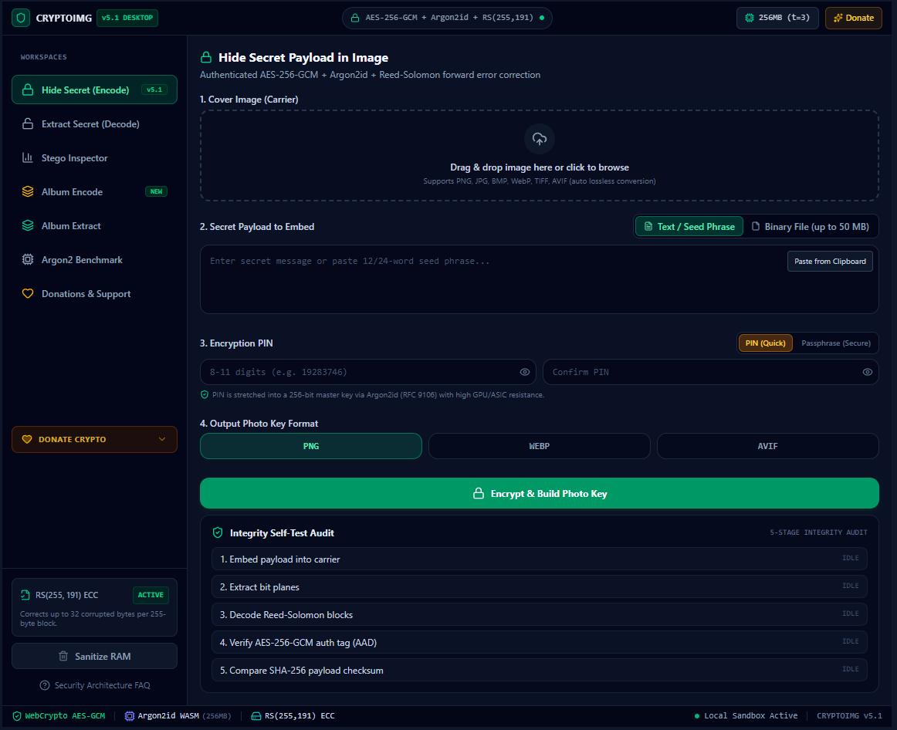
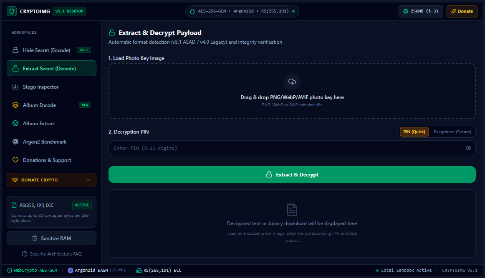
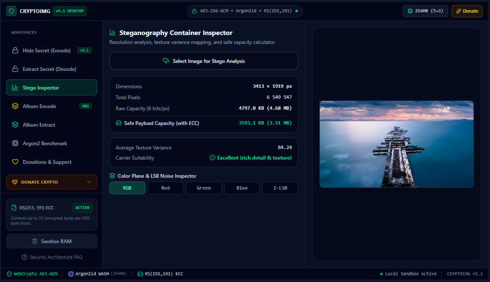
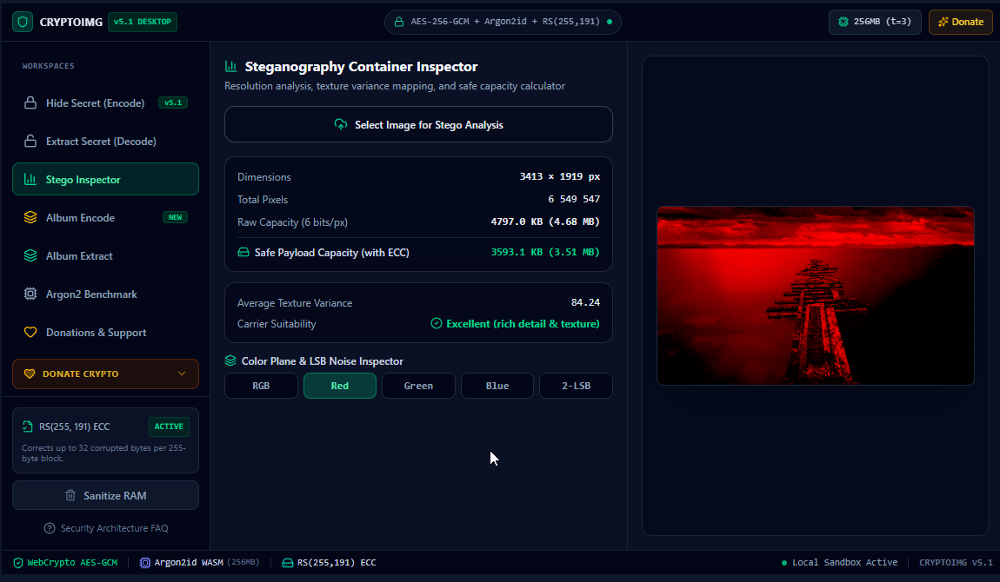
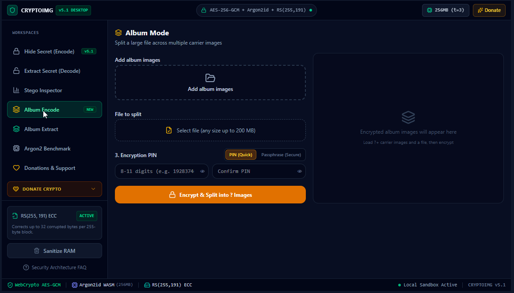
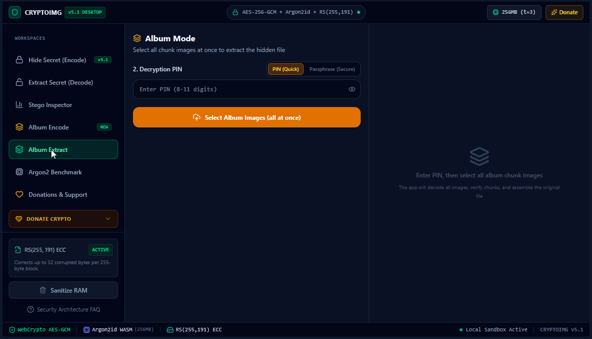
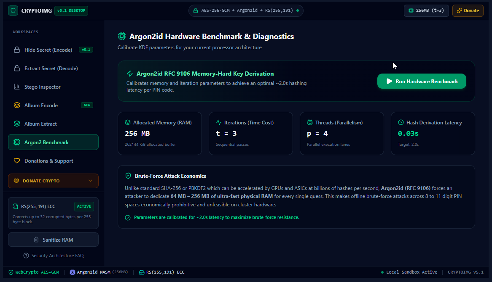
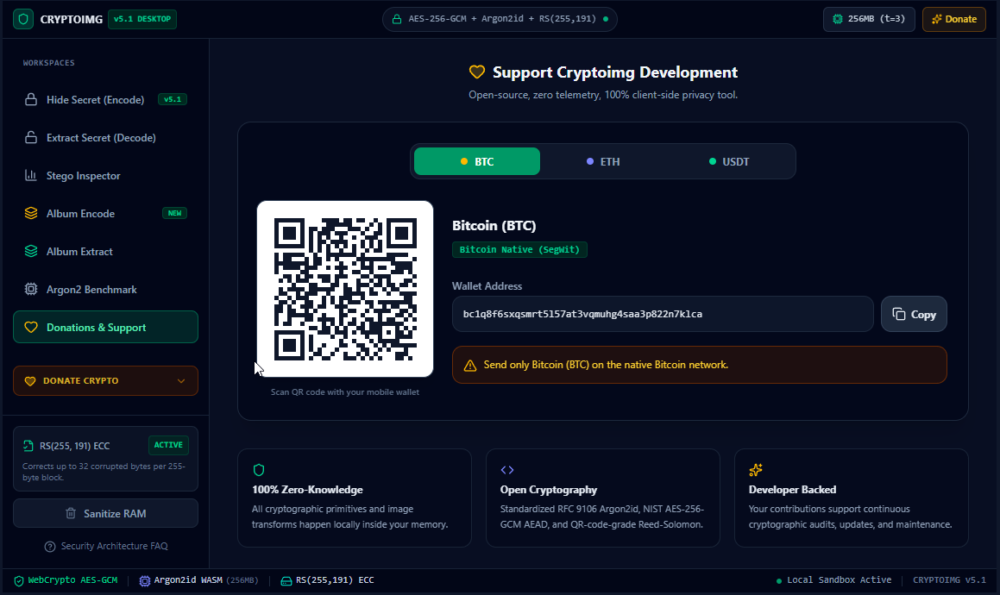

<div align="center">

# 🛡️ Cryptoimg

### Hide Any Secret Inside Any Image

**AES-256-GCM · Argon2id · Reed-Solomon · LSB Steganography**

100% client-side. Zero server. Your data never leaves your device.

[**Launch Web App**](https://cryptoimg.wasmer.app) · [**Download Windows**](#downloads) · [**Download Android**](#downloads) · [**Documentation**](#how-it-works)

</div>

---

## What is Cryptoimg?

Cryptoimg is an open-source steganography tool that hides files inside images using military-grade encryption. It combines **AES-256-GCM** authenticated encryption, **Argon2id** key derivation, and **Reed-Solomon** error correction to create stego-images that are both invisible and tamper-proof.

All cryptographic operations run entirely in your browser via WebAssembly and the Web Crypto API — **no data is ever sent to a server**.

## Features

| Feature | Description |
|---------|-------------|
| **Encode** | Hide any file (documents, archives, executables) inside an image |
| **Decode** | Extract hidden data using your PIN code |
| **Album Mode** | Split large files across multiple images with automatic reassembly |
| **Inspector** | View image metadata and detect steganographic content |
| **Self-Test** | Automatic verification that encoded data can be extracted correctly |
| **Multi-language** | EN, RU, DE, FR, ES, ZH |
| **Cross-platform** | Web, Windows (NSIS + portable), Android (APK) |

## Screenshots

### Hide Secret (Encode)


### Extract Secret (Decode)


### Stego Inspector — RGB Analysis


### Stego Inspector — Red Channel


### Album Encode — Split Large Files


### Album Extract — Reassemble Chunks


### Argon2id Benchmark & Diagnostics


### Donations & Support


## How It Works

```
📄 Your File → 📦 Deflate → 🔑 AES-256-GCM → 🛡️ Reed-Solomon → 🖼️ LSB Embed → 📸 Output Image
```

### Cryptographic Pipeline

| Component | Algorithm | Purpose |
|-----------|-----------|---------|
| Key Derivation | Argon2id (65 MB, 3 iter, p=4) | PIN → 256-bit stego key + 256-bit enc key. GPU/ASIC resistant. |
| Key Expansion | HKDF-SHA256 | Derives separate stego key and encryption key from Argon2 output. |
| Encryption | AES-256-GCM | Authenticated encryption. 12-byte nonce, 16-byte auth tag. |
| Compression | DEFLATE (raw) | Reduces payload size. ~50-70% ratio on text. |
| Error Correction | Reed-Solomon GF(2^8) | Protects against minor image modifications. 25% overhead. |
| Steganography | LSB in variance-filtered pixels | Data hidden in least-significant bits with adaptive pixel selection. |
| Self-Test | Extract → decrypt → verify MAGIC | After encoding, immediately verifies data can be extracted. |
| Album Mode | CHUNK record + SHA-256 | Splits large files across multiple images. Each chunk independently encrypted. |

## Getting Started

### Web (No Installation)

Visit **[cryptoimg.wasmer.app](https://cryptoimg.wasmer.app)** and start encoding immediately.

### Windows

Download the installer or portable executable from the [Releases](#downloads) section.

### Android

Download the APK and install on Android 7.0+.

## For Developers

### Prerequisites

- [Node.js](https://nodejs.org/) 18+
- npm

### Local Development

```bash
# Clone the repository
git clone https://github.com/nsmykh70-creator/cryptoimg.git
cd cryptoimg

# Install dependencies
npm install

# Start development server
npm run dev
```

The app will be available at `http://localhost:3000`.

### Build Commands

```bash
# Build for web
npm run build

# Build Windows installer + portable
npm run dist:win

# Build Windows portable only
npm run dist:portable

# Build for Android
npm run android:sync
npm run android:open
```

### Project Structure

```
cryptoimg/
├── src/                    # React application source
│   ├── App.tsx            # Main app component
│   ├── crypto/            # Cryptographic engine (hash-wasm)
│   └── components/        # UI components
├── web/                    # Static web deployment (Wasmer)
├── webapp/                 # Alternative web build
├── electron/              # Electron desktop wrapper
├── android/               # Capacitor Android project
├── public/                # Static assets
├── wasmer.toml            # Wasmer deployment config
└── electron-builder.json  # Electron build config
```

## Security

### Design Principles

- **Zero-knowledge architecture**: No servers, no logs, no telemetry
- **Client-side only**: All crypto runs in your browser via WebAssembly
- **Authenticated encryption**: AES-256-GCM detects any tampering
- **Memory-hard KDF**: Argon2id resists GPU/ASIC brute-force attacks
- **No backdoor**: Lost PIN = lost data. This is by design.

### Argon2id Parameters

| Parameter | Value | Purpose |
|-----------|-------|---------|
| Memory | 65 MB | Prevents GPU/ASIC attacks |
| Iterations | 3 | Computational cost |
| Parallelism | 4 | Multi-core utilization |

### Supported Formats

| | Input | Output |
|---|---|---|
| **Formats** | JPEG, PNG, WebP, AVIF, BMP, TIFF | PNG, WebP, AVIF (lossless) |
| **Max capacity** | — | ~6.5 KB per 1920×1080, ~65 KB per 3840×2160 |

> **Note**: JPEG input is auto-converted to lossless format before encoding.

## FAQ

**Is the data really hidden?**
Cryptoimg uses LSB steganography in variance-filtered pixels with keyed permutation. The changes are visually identical to the original. Note: no steganography is truly undetectable against a determined adversary with the original image.

**What happens if I lose the PIN?**
The data is gone. The PIN is the only way to derive the decryption key. There is no backdoor or recovery mechanism. This is by design.

**Can I share the output on social media?**
Social media re-compresses images, which can destroy hidden data. Use lossless sharing: email, cloud storage, or direct file transfer.

**How is this different from encryption?**
Encryption makes data unreadable. Steganography makes data invisible. Cryptoimg does both — the image looks normal, there is nothing to intercept.

**Is anything sent to a server?**
No. Everything happens in your browser using Web Crypto API, WebAssembly, and Canvas API. Zero network requests during encode/decode.

## Downloads

| Platform | File | Notes |
|----------|------|-------|
| 🌐 **Web** | [cryptoimg.wasmer.app](https://cryptoimg.wasmer.app) | No installation required |
| 🪟 **Windows** | `Cryptoimg-5.1.0-x64.exe` | NSIS installer |
| 🪟 **Windows** | `Cryptoimg-Portable-v5.1.0.exe` | Portable (no install) |
| 🤖 **Android** | `Cryptoimg-Android-v5.1.0.apk` | Android 7.0+ |

## Tech Stack

- **Frontend**: React 19, TypeScript, Tailwind CSS v4, Vite
- **Crypto**: hash-wasm (Argon2id, AES-GCM, SHA-256, Reed-Solomon)
- **Desktop**: Electron 44
- **Mobile**: Capacitor 8
- **Deployment**: Wasmer (static + Node.js server)

## License

MIT License

## Support

If this tool is useful to you, consider supporting development:

- **Bitcoin**: `bc1q48l0mfvrs6kza5xs6qmzagatmpelrxzyqcwfhpz`
- **Ethereum**: `0x6889fD4d5B688d6E3c4b7E5A2B1D6E8F2C3A4b5D`
- **USDT (TRC-20)**: `TN7V3t8EKjRTJFXNJwMjYpLqHGSQN7BTyv`

---

<div align="center">

**[Launch App](https://cryptoimg.wasmer.app)** · [Report Issue](https://github.com/nsmykh70-creator/cryptoimg/issues) · [Source Code](https://github.com/nsmykh70-creator/cryptoimg)

</div>
